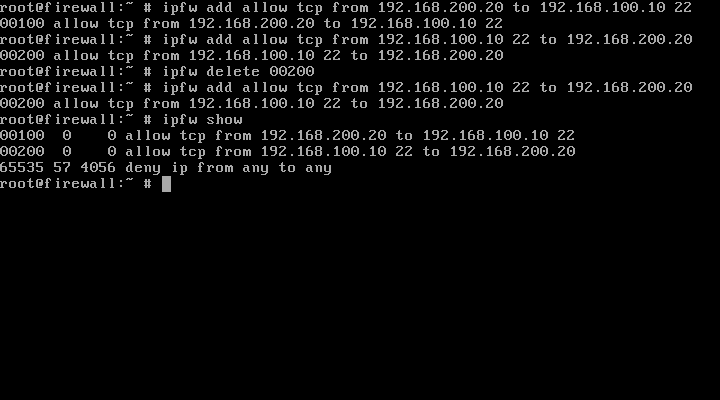

Primeiramente vamos carregar o modulo do firewall 

**Regras de firewall especificas devem vir primeiro do que regras mais genericas**

```
kldstat
```
```
kldload ipfw
```
```
# Listar todas as regras
ipfw show
```

```
# adicionar uma regra
ipfw add allow tcp from 192.168.100.10
```

```
# netcat to listen
# port = 10000
nc -l 10000

# netcat stablish connection
# port = 10000
nc 192.168.100.10 10000

```


```
# Escutar tudo que passa em uma interface de rede
tcpdump -i eth0
```


```
# Limpar todas as regras
ipfw flush
```

```
ipfw delete <line_number>
```




