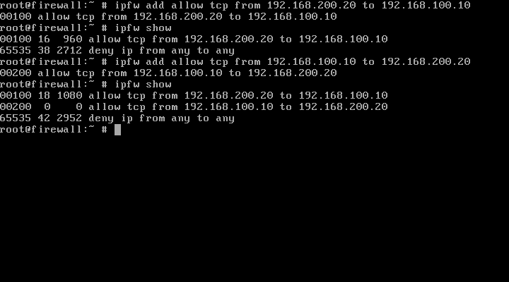
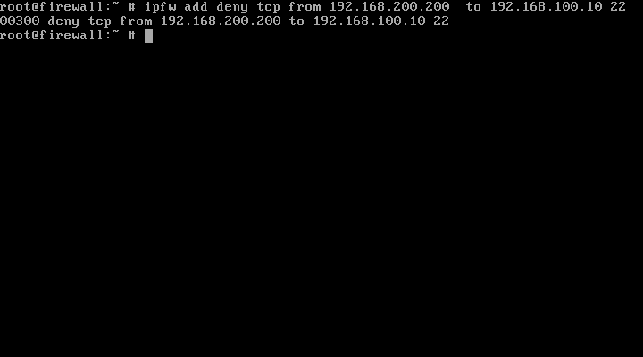

Primeiramente vamos carregar o modulo do firewall 

```
kldstat
```
```
kldload ipfw
```
```
ipfw show
```

```
ipfw add allow tcp from 192.168.100.10
```

```
# netcat to listen
# port = 10000
nc -l 10000

# netcat stablish connection
# port = 10000
nc 192.168.100.10 10000

```



```
tcpdump -i eth0
```


